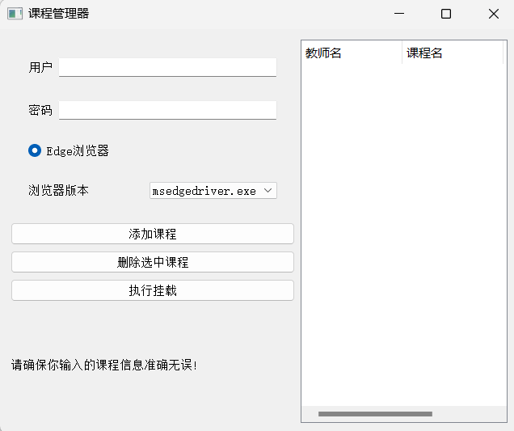
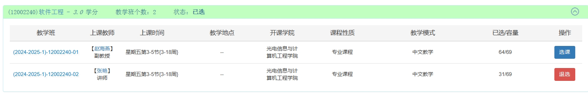
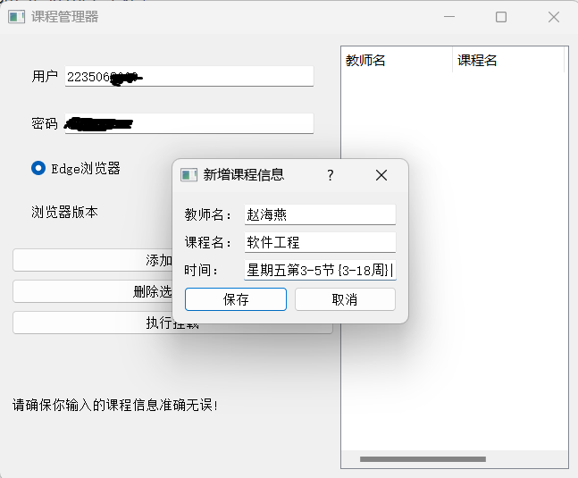

## Course Spider for USST（上理工抓课工具）

​	Course Spider for USST是一款基于Python的后台挂载工具，主要用于在USST（上海理工大学）教务处自动检查是否有课程余量并进行合适操作。本项目旨在为学生提供方便快捷的课程获取途径，助力高效学习。

​	先决条件：请确保运行环境是`Windows`电脑，并且你的电脑上安装有`Edge`浏览器

​    主页面：




##### 项目特点：

1. 采用Splinter库进行网页解析，轻松应对复杂网页结构。
2. 使用PyQt5库编写用户界面，界面简洁、操作便捷。
3. 自动化精准匹配课程信息，节省学生选课时间。
4. 支持查看选课页面，为学生提供动态视图。

##### 更新事项：

1. 界面代码优化。
2. 兼容Edge浏览器的多种内核，可根据版本自行替换。
2. 自动释放浏览器驱动。

##### 适用人群：

1. USST Humble Students.

##### 使用说明：

1. 项目目前只支持Edge浏览器

2. 根据提示进行操作，输入所需信息，即可开始体验选课后台挂载。

##### 注意：

1. 请遵循相关法律法规，合理使用爬虫技术。
2. 项目中涉及到的网址、图片等资源，请确保合规获取。
3. 项目本身不会采集用户的任何信息，请确保在安全的环境下使用程序。

##### 使用教程：

1. 首先确保项目中满足如下的目录格式：

   ```
   your_project_name(随意取名)/
   ├── courseSpider.exe/
   ├── edgedriver/
   │   └── msedgedriver.exe
   ```

   若不满足以上的文件目录格式，程序运行将出错

2. 检查你的`Edge`版本，打开你的浏览器，输入`edge://version/`，查看你的浏览器版本是否为`125.0.2535.51 (正式版本) (64 位)` 

3. 若第2步中的版本是`125.0.2535.51 (正式版本) (64 位)`，则本步可以忽略。若不是，则请到：https://developer.microsoft.com/en-us/microsoft-edge/tools/webdriver/ 网站上下载与你`Edge`浏览器版本对应的`msedgedriver.exe`，然后放到根目录的文件夹下方，覆盖原有的文件

4. 登录你的教务管理系统，获取你想要抢课的课程信息：

   

   这边以软件工程课程为例子，需要获取教师姓名，课程名称和上课时间三个信息

5. 双击运行`courseSpider.exe`文件，输入你的一网怅学用户名和密码，然后点击`添加课程`，输入相关的信息

   

   点击`执行挂载`，即可看到你的浏览器被打开，执行抢课的相关操作：

##### 参考文档：

1. [Splinter官方文档](https://splinter-docs-zh-cn.readthedocs.io/zh/latest/index.html)
2. [PyQt5参考案例](https://zhuanlan.zhihu.com/p/482754031)

如有问题，请查阅项目文档或联系作者。感谢您的使用，祝您学习愉快！
